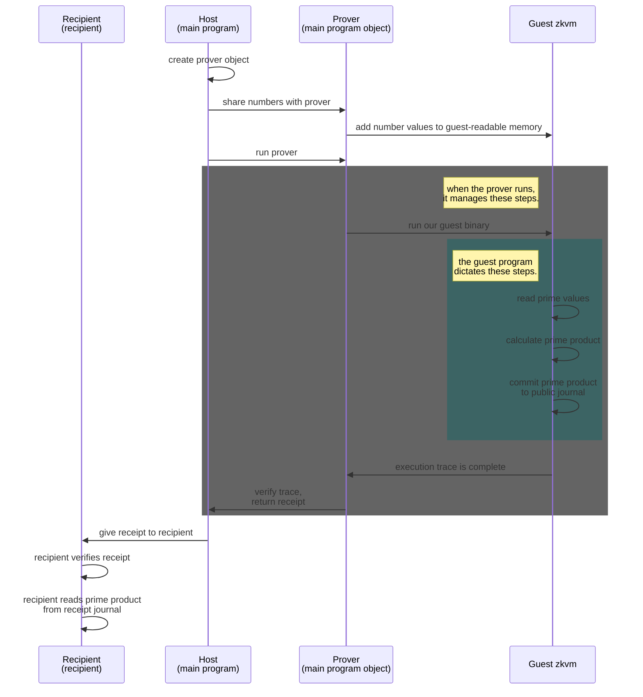

In this post, we introduce a simple Rust code project written for the RISC Zero zero-knowledge virtual machine (zkVM). In this post, we won't show you how to write a full program, but reading this should help you get acquainted with writing code for the zkVM. Although code has been omitted for simplicity, we strongly recommend reading the following explanation in conjunction with the [RISC Zero Rust starter example](https://github.com/risc0/risc0-rust-starter) repository.

By reading this post, you should learn, at a high level:
* How RISC Zero can be used to convince someone that code has executed on the zkVM
* How we make programs and variables available to the zkVM guest
* What zkVM guest programs can do to publicly share computation results
* How this code example can be adapted to send to a real recipient

# A program to multiply two numbers in the zkVM

In the Rust starter program, we demonstrate how to multiply two numbers and share their product without revealing what the two factors are. The RISC Zero zkVM provides a cryptographically strong argument that we performed the computation, which is witnessed by a verifiable "receipt." By sharing the receipt, we can convince a skeptical third party that we ran the computation faithfully and that the output is honest.

# Differentiating host and guest code

The host driver program runs the guest zkVM. Most code written for the guest zkVM lives in [`methods/guest/src/bin/multiply.rs`](https://github.com/risc0/risc0-rust-starter/blob/main/methods/guest/src/bin/multiply.rs). The main function for our host program code  lives in [`starter/src/main.rs`](https://github.com/risc0/risc0-rust-starter/blob/main/starter/src/main.rs).

When the host code executes, it creates a prover instance that is responsible for all guest zkVM interactions:

```
    let mut prover = Prover::new(&std::fs::read(MULTIPLY_PATH).unwrap(), MULTIPLY_ID).unwrap();
```

 The prover runs an ELF binary of the zkVM guest code. After the guest code has executed, the prover returns a [receipt](https://www.risczero.com/docs/explainers/proof-system/what_is_a_receipt). In our example, these are accomplished with the following line in the `starter/src/main.rs` host source code:

```
let receipt = prover.run().unwrap();
```

# Understanding the prover

When a prover runs code on the zkVM, two important things happen:
1. The ELF binary execution produces an [execution trace](https://www.risczero.com/docs/explainers/proof-system/what_is_a_trace). If valid, the trace generates a `cryptographic seal` that shows the execution followed RISC-V rules.
2. Any values the guest shares are written to the `journal`.

A hash of the journal is included in the cryptographic seal so that the recipient will know if it has been altered.

The diagram below shows these components in action:


<!--
```mermaid
flowchart LR
A(multiply.rs)-|compiles to an|->B(ELF binary)
B-|Whose execution produces an|-> C(Execution trace)
B-|Whose hash forms a unique|->D(Method ID)
D-|That can be compared to the|->E(Cryptographic seal)
C-|That, if valid,<br>generates a|->E(Cryptographic seal)
B-|Whose operations can include<br>committing values to a|->F(Journal)
subgraph Together, these form a receipt.
E
F
end
subgraph x[The receipt tells us:]
E---H(What binary executed in the ZKVM<br>Whether the execution<br>followed expected behavior<br/><br/>Whether the journal or method ID<br/>have changed)
F---I(The values of all contents<br>written to the public journal)
end
style B fill:#3c6464
style x fill:none, stroke:none
style H fill:none,stroke:none
style I fill:none,stroke:none
```
-->

For more details on this process, see our [zkVM Overview](https://www.risczero.com/docs/explainers/zkvm/zkvm_overview); for maximal detail, see our [proof system sequence diagram](https://www.risczero.com/docs/explainers/proof-system/proof-system-sequence-diagram). In the next section, we'll show how this process is managed from the perspective of the host program, the guest zkVM program, and the prover object that we call from the host. 

# Interacting with the prover

The process diagram below shows the execution steps relevant to host and guest interactions. To illustrate the responsibility of the `prover`, we have included it as a separate entity. In practice, this object is instantiated on the host and lives in host memory.


<!--

-->
Some of the steps described above are handled by [RISC Zero project code](https://github.com/risc0/risc0) (such as the `prover.run()` function); other steps are performed explicitly by host or guest code. For example, the values shown in the blue box are dictated by guest zkVM code (`multiply.rs`). Others, like verifying the execution trace and producing a receipt, are a part of our prover object's internally defined behavior.

To get you started, the next section describes which actions must be explicitly included in host and guest code instructions. Read it along with the `main.rs` and `multiply.rs` files to get ready to create your own projects.

# Writing host and guest programs

The following steps are included in the `main.rs` host program before the prover is called. Before the host program tells the prover to execute the guest program, it needs to make sure that all relevant methods and values are accessible to the guest.

1. The host creates a Prover object, passing it the ELF path and method ID for `multiply`.

2. The host makes sure that the guest can read the two numbers being multiplied. The function `prover.add_input()` sends the host-defined numbers to the guest.

The host then calls the prover's `run()` method. The prover executes a compiled binary of the guest program, which sets in motion the process of generating a trace and producing a receipt. As the guest binary executes, the zkVM performs the following steps, as dictated by the code in `multiply.rs`:

1. The two number values are read from guest-accessible memory using `env::read()`.

2. The numbers are multiplied together and the result is saved.

3. To share the computed result, the guest writes them to the journal using the call `env::commit()`.

After the guest program has executed, the prover returns a `Receipt` object. Recall that this object includes the method ID, journal (with shared results), and a cryptographic seal.

If we send the receipt to someone else, then they can see we ran the expected program (using the method ID); they can also read the computed product from the receipt's journal contents.

# A note on practical use

For brevity (and to stay agnostic about use cases), our starter example omits a few steps that would typically happen after the prover generates a receipt. 

In our example, the receipt is verified from the `main.rs` host program. However, the value of the receipt is that it can convince another party we ran the `multiply.rs` program. In a real-world scenario, then, we would want to send the receipt to someone else, most likely by serializing it and passing it over a network.

We would also want to give the source code for the guest program to the recipient. The recipient would generate the `method ID` of the zkVM program binary on their side and use this to check the receipt's method ID.

In an upcoming article, we'll show you how the computational receipt is created and checked in greater detail as we walk through how RISC Zero projects can allow us to trust user-provided data. We'll look at a slightly (but not much) more involved program that allows a user to check their own password against a set of validity requirements (e.g., the inclusion of uppercase letters) and provide their own password hash. If you have any questions or are interested in talking about zkVM projects, come find us on [Twitter](https://twitter.com/risczero) and [Discord](https://discord.com/invite/risczero). We'd love to see what you build using the RISC Zero zkVM!
