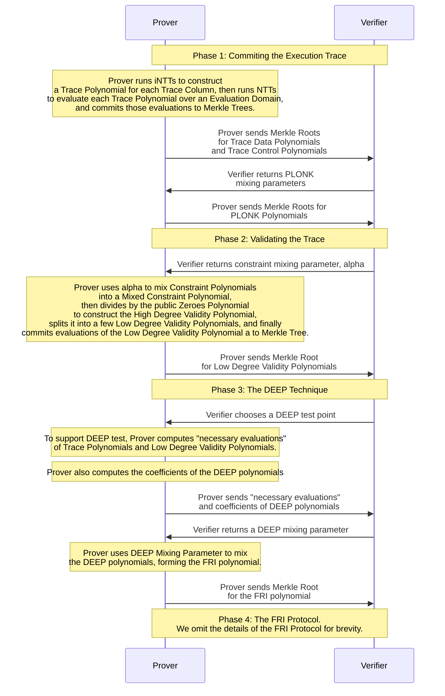

# ZKP Sequence Diagram and Spec

*RISC Zero offers a [computational receipt](what_is_a_receipt.md) for any code that runs within the [RISC Zero zkVM](../zkvm/zkvm_overview.md), which serves to verifiably link the code that ran to the asserted output. RISC Zero's receipts are built on the shoulders of several recent advances in the world of Zero-Knowledge Cryptography: [zk-STARKs](https://eprint.iacr.org/2018/046.pdf), [PLONK](https://eprint.iacr.org/2019/953.pdf), and [DEEP-ALI](https://arxiv.org/pdf/1903.12243.pdf).*

*In this document, we present a succinct introduction to the RISC Zero Proof system, including a sequence diagram and a step-by-step description of the RISC Zero Non-Interactive Argument of Knowledge. We encourage readers to follow along with [Constructing a Seal](constructing-a-seal.md) for a more concrete description of the protocol.*

*To invite collaboration and open source development, this is an early-release of documentation-in-progress. The implementation in code can be seen [here](https://github.com/risc0/risc0/blob/v0.7.2/risc0/zkp/prove/prove.cpp). If you have questions/feedback or if you find errors, please let us know on Twitter or Discord.*

## The RISC Zero Proof System: A Step-By-Step Description

### Phase 1: Committing the Execution Trace
- The Prover runs a computation in order to generate an [`Execution Trace`](what_is_a_trace.md). 
  - The `trace` is organized into `columns,` and the columns are categorized as `control columns`, `data columns`, and `PLONK columns`.
    - The `control columns` handle system initialization and shutdown, the initial program code to load into memory before execution, and other control signals that don't depend on the program execution.
    - The `data columns` contain the input and the computation data, both of which are private. These columns are committed in two orderings: 
      - in order of program execution, and 
      - re-ordered by register first and clock cycle second. The re-ordered columns allow for efficient validation of RISC-V memory operations.
    - The `PLONK columns` are used to show the validity that the re-ordered data columns are a valid permutation of the original data, as per the PLONK permutation argument. 
  - After computing the `data columns` and `PLONK columns,` the Prover adds some random `noise` to the end of those columns in order to ensure that the protocol is zero-knowledge.
- The Prover encodes the `trace` as follows:  
  - The Prover converts each `column` into a polynomial using an `iNTT`. We'll refer to these as `Trace Polynomials`, denoted $P_i(x)$.
  - The Prover evaluates the `data polynomials` and the `control polynomials` over an expanded domain and commits the evaluations into two separate Merkle Trees.
  - Using these Merkle roots as an entropy-source, we use Fiat-Shamir to choose `PLONK mixing parameters,` using a SHA-2 CRNG.
  - Then, the Prover uses the `PLONK mixing parameters` to generate the `PLONK columns`, interpolates them to form the `PLONK polynomials,` evaluates those polynomials over a larger domain, and commits those evaluations to a Merkle tree (see the [PLONK paper](https://eprint.iacr.org/2019/953.pdf) for details). 
  - The Prover sends the Merkle root of each tree to the Verifier.
  - Using these three Merkle roots as an entropy-source, we use Fiat-Shamir to choose a `constraint mixing parameter` $\alpha$, using a SHA-2 CRNG.
### Phase 2: Validating the Trace: the Core of the STARK Proof
- The Prover uses the `constraint mixing parameter`, the `Trace Polynomials`, and the `Rule Checking Polynomials` to construct a few `Low Degree Validity Polynomials.` The details are as follows:
  - By writing $k$ publicly known `Rule Checking Polynomials`,  $R_0, R_1, ..., R_{k-1}$, in terms of the private `Trace Polynomials`, the Prover generates $k$ `Constraint Polynomials`, $C_j(x)$. 
    - The key point about these polynomials is that for each of the $k$ rules and each input $z$ that's associated with the trace, $C_j(z)$ will return 0 if the trace "passes the test," so to speak. 
  - Using the `constraint mixing parameter` $\alpha$, the Prover combines the `Constraint Polynomials`, $C_j$ into a single `Mixed Constraint Polynomial`, $C$, by computing $C(x)=\alpha^0C_0(x)+\ldots+\alpha^{k-1}C_{k-1}(x).$ 
    - Note that if each $C_j$ returns 0 at some point $z$, then $C$ will also return 0 at $z$. 
  - Using a publicly known `Zeros Polynomial`, the Prover computes the `High Degree Validity Polynomial`, $V(x)=\frac{C(x)}{Z(x)}$.
    - The `Zeros Polynomial` $Z(x)$ is a divisor of any honest construction of $C(x)$. In other words, an honest prover will construct $V(x)$ to be a polynomial of lower degree than $C(x)$. We call $V$ "high degree" relative to the Trace Polynomials, $P_i$.
  - The Prover `splits` the `High Degree Validity Polynomial` into 4 `Low Degree Validity Polynomials`, $v_0(x), v_1(x), ..., v_3$. 
  
  - The Prover evaluates the `Low Degree Validity Polynomials`, encodes them in a Merkle Tree, and sends the Merkle root to the Verifier. 
  
  - We use Fiat-Shamir to choose the `DEEP Test Point`, $z$. 
### Phase 3: The DEEP Technique
- The Verifier would like to check the asserted relation between $C$, $Z$, and $V$ at the `DEEP Test Point,` $z$. Namely, the Verifier would like to confirm that $V(z)Z(z)=C(z)$.
  - The Prover sends the evaluations of each $v_i$ at $z$, which allows the Verifier to compute $V(z)$. 
  - Computing $C(z)$ is slightly more complicated. Because `rule checks` can check relationships across multiple `columns` and multiple `clock cycles`,  evaluating $C(z)$ requires numerous evaluations of the form $P_i(\omega^nz)$ for varying `columns` $i$ and `cycles` $n$. The Prover sends these `necessary evaluations` of each $P_i$ to allow the Verifier to evaluate $C(z)$. We refer to the `necessary evaluations` $P_i(\omega^nz)$ as the `taps` of $P_i$ at $z$. 
  - The Verifier can now check $V(z)Z(z)=C(z)$. 
  - Although these asserted evaluations have no associated Merkle branches, the DEEP technique offers an alternative to the usual Merkle proof.
- The Prover constructs the DEEP polynomials using the `taps`:
  - Denoting the `taps` of $P_i$ at $z$ as $(x_1,P_i(x_1)),\ldots,(x_n,P_i(x_n))$, the Prover constructs the DEEP polynomial $P'_i(x)=\frac{P_i(x)-\overline{P_i}(x)}{(x-x_1)\ldots(x-x_n)}$ where $\overline{P_i}(x)$ is the polynomial formed by interpolating the taps of $P_i$. The Prover computes $P'_i$, runs an iNTT on the result, and sends the coefficients of $P'_i$ to the Verifier. Using this technique, the Prover constructs and sends a DEEP polynomial for each $P_i$ and each $v_i$. 
- At this point, the claim of trace validity has been reduced to the claim that each of the DEEP polynomials is actually a low-degree polynomial. To conclude the proof, the Prover mixes the DEEP polynomials into the `FRI Polynomial` using a `DEEP mixing parameter` and use the FRI protocol to show that the `FRI Polynomial` is a low-degree polynomial. 
### Phase 4: The FRI Protocol
- We omit the details of the FRI Protocol for brevity. 

Thanks for reading! If you have questions or feedback, we'd love to hear from you on Discord or Twitter.